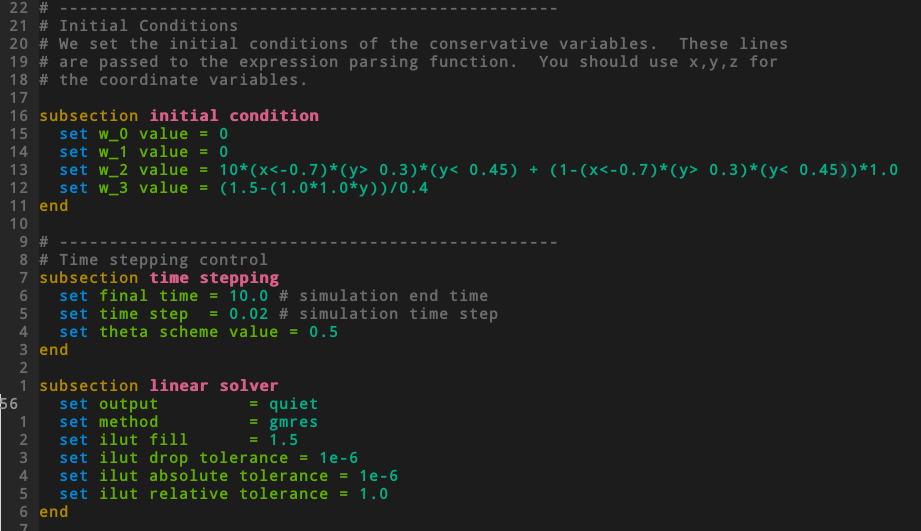

# vim-dealii-prm
Neovim/Vim configuration for Deal.II's parameter files.

Make sure to enable the following options in `.vimrc` (or `init.vim`
for neovim).

```vim
syntax enable
filetype plugin indent on
```

## Features

* Syntax highlighting
* Auto-indenting

## Screenshot



